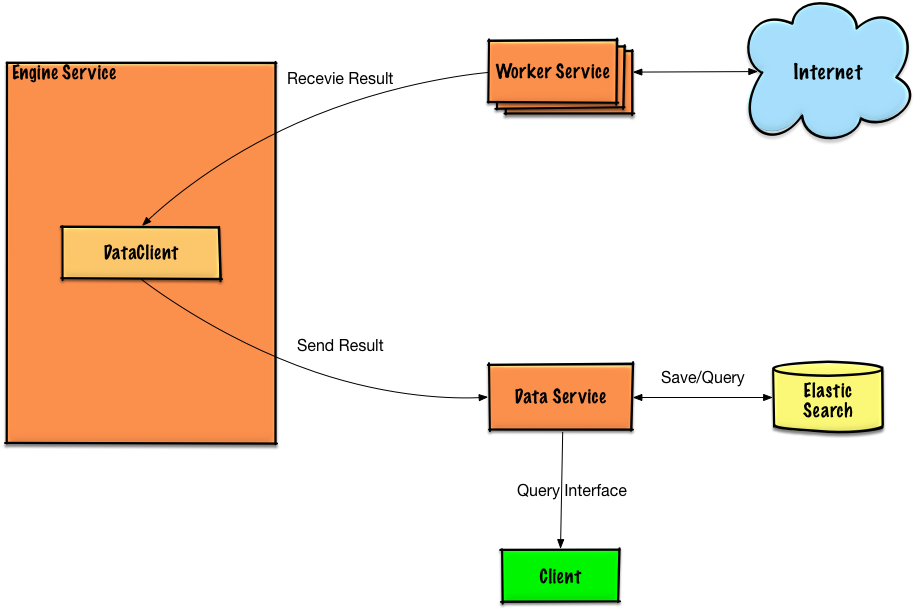

# GoP2PSpider
A distributed P2P spider made by Go, only for study, based on https://github.com/fanpei91/p2pspider.

These images can include anything about GoP2PSpider:

# How to run it
1. install go, and `go get gopkg.in/olivere/elastic.v5` `github.com/xbox1994/bencode` `go get golang.org/x/time/rate`
2. make your server udp inbound port available(default: 6881)
3. run data service `go run data/server/main.go --port 9001`
4. run engine service `go run engine/server/main.go --port 9000 --data_service_host=":9001"`
5. run as many workers as possible `go run worker/server/main.go -p 6881`

# TODO
1. worker code refactor
2. performance enhancement
