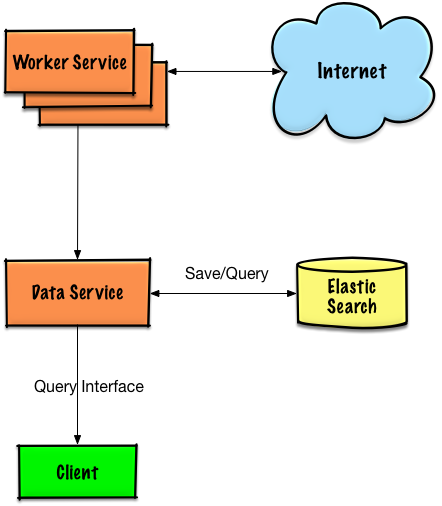

# GoP2PSpider
A distributed P2P spider made by Go, only for study, based on https://github.com/fanpei91/p2pspider.

GoP2PSpider architecture image:

# How to run it
1. run `dependence_install.sh`
2. make udp all inbound port available
3. run data service on one server `go run data/server/main.go`
4. run as many workers as possible in any server `go run worker/server/main.go -wc 50`

# TODO
1. worker code refactor
2. worker performance enhancement
3. setup output log file
4. data service query api and web interface
5. restart all service script on localhost